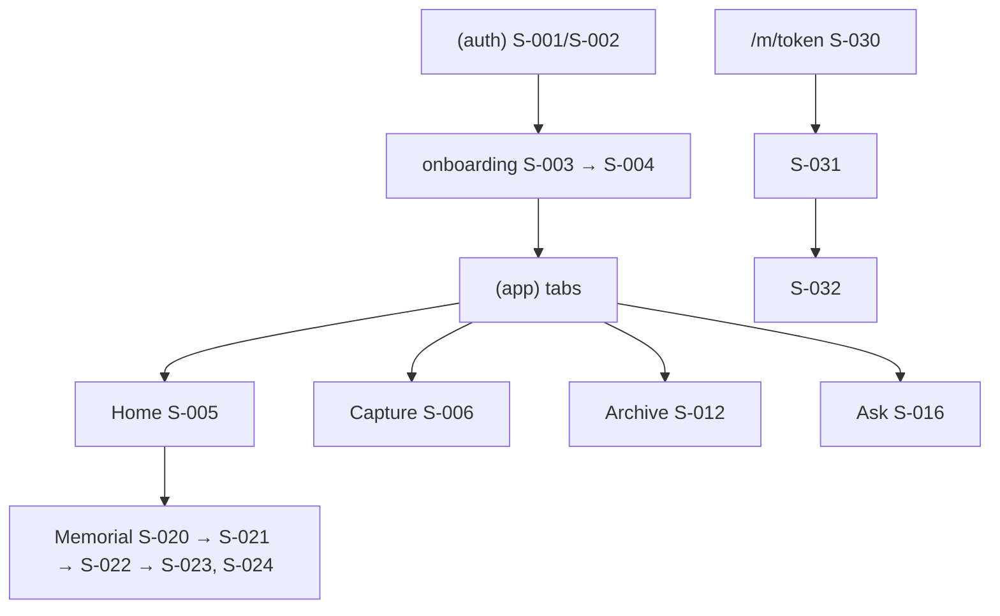

# Sitemap — screens, IA, routes, access

**Project:** GUNITA
**Maintained by:** Alex
**Last updated:** 2026-09-23 (synced to ADR-004 / ADR-005)
**Status:** Draft
**FMD version:** 4.6.2

> **Purpose:** the static half of ux-maps: what exists, where it lives, who can reach it.
> Movement between screens lives in [User Flow](user-flow.md).
> Traces back to: [PRD](prd.md) (`F-###`), [ADR-004](adr/ADR-004-single-web-app.md),
> [ADR-005](adr/ADR-005-ui-language.md).
> Traces forward to: user-flow, system design, QA.

One Next.js app (ADR-004): **family/steward UI** (mobile-first) and **public memorial** pages
share the same deploy. API routes are not screens; see [System Design](system-design.md).
UI copy ships in `fil` or `en` (ADR-005).

---

## 1. Navigation model

**Family UI, primary pattern:** bottom tab bar with four tabs once signed in and consent is
recorded. Steward-only destinations open from Home cards and the Family tab, not from extra tabs.

**Why:** the steward's daily loop is capture → review → use; four tabs keep every core action one tap
away on a phone held by someone sitting with an elder.

**Web memorial, primary pattern:** no navigation chrome. One vertical recap with a fixed
"Share a memory" button (Scan → Remember → Share a memory).

**Top-level destinations (family UI):**

| Destination | Label shown | Screen | Route | Auth | Serves |
|---|---|---|---|---|---|
| Home | Home | S-005 | `/(app)/home` | Session | F-001, F-014, F-016 |
| Capture | Capture | S-006 | `/(app)/capture` | Session (steward records; family uploads) | F-003, F-004, F-005 |
| Archive | Archive | S-012 | `/(app)/archive` | Session | F-010, F-011 |
| Ask | Ask | S-016 | `/(app)/ask` | Session | F-012, F-013 |

**Persistent elements (family UI):** top bar showing the featured person's name and a mode badge
(During / Memorial); a review-queue count on Home for the steward.

**Back / exit behavior:** system back always returns to the previous screen. Leaving S-007 with an
unsent recording asks to keep or discard it. Memorial activation cannot be undone by back; it
needs S-020's reverse action.

---

## 2. Screen inventory

### Family UI (authenticated)

| ID | Screen | Purpose (one line) | Serves | Entry points | Auth | Required states |
|---|---|---|---|---|---|---|
| S-001 | Sign in | Email + password sign in | F-001 | app launch, session expired | Public | idle / submitting / error |
| S-002 | Sign up | Create account; optional invite code joins a family space | F-001 | S-001 link | Public | idle / submitting / invalid code / error |
| S-003 | Create family space | Steward names the featured person and sets space UI language (`fil` / `en`) | F-001, BR-014 | first sign-in without a space | Session | idle / submitting / error |
| S-004 | Consent | Record the person's consent (voice or written), choices (AI, family default, memorial use, voice clips), steward attestation | F-002 | after S-003; blocks capture until done | Steward | not started / recording / saved / error |
| S-005 | Home | Mode badge, review count, next GUNITA Questions, memorial entry (steward) | F-001, F-014, F-016 | tab | Session | empty / loading / error / success |
| S-006 | Capture hub | Start interview, add photo/document, type a memory | F-003, F-004, F-005 | tab | Session | loading / success; consent missing → blocked message |
| S-007 | Interview session | One question at a time, large text; record/stop/re-record; edit/skip question | F-003, F-004 | S-006, S-008 | Steward | idle / recording / uploading / upload failed (retry) / done |
| S-008 | Question queue | GUNITA Questions with "why asked" and source; queue, reorder, dismiss | F-014, F-004 | S-005, S-006 | Steward | empty / loading / error / success |
| S-009 | Add artifact | Pick photo or PDF, add known context | F-003, F-005 | S-006 | Session | idle / uploading / error |
| S-010 | Source detail | Processing status, transcript or AI-read text, what's missing, extracted items, retry | F-005, F-006, F-007 | S-009, S-007 done, review | Session | processing / ready / failed (retry) |
| S-011 | Review queue | AI suggestions waiting for review | F-008, F-015 | S-005 | Steward | empty / loading / error / success |
| S-012 | Archive | Tabs: Stories, Recipes, Traditions, Lessons, People, Photos & documents, Memories from others; search bar | F-010, F-011, F-015 | tab | Session | empty / loading / error / success |
| S-013 | Item detail | Item with badges, source playback of the exact span, history (steward), actions (steward: review, visibility, correct, delete) | F-007, F-008, F-009, F-015, F-021 | S-011, S-012, S-015, S-016 | Session (actions: steward) | loading / error / success / not visible (404) |
| S-014 | Person detail | Aliases, relationship, items mentioning the person | F-006, F-010 | S-012, S-013 | Session | loading / error / success |
| S-015 | Search results | Meaning-based results, badges, no generated text | F-011 | S-012 search bar | Session | empty / loading / error / success |
| S-016 | Ask GUNITA | Question box; answer with cited sentences, evidence groups, Hindi pa alam, refusal, "Add as question" | F-012, F-013, F-015, F-022 | tab | Session | idle / thinking / answered / abstained / refused / error |
| S-017 | Add my memory | Family member types a memory or adds a photo (About them) | F-003 | S-006 | Session | idle / submitting / error |
| S-018 | Family & invites | Members list; steward creates invite codes | F-001 | Home menu | Session (invites: steward) | empty / loading / error / success |
| S-019 | Space settings | Consent status, withdraw consent, space UI language (`fil` / `en`) | F-002, F-021, BR-014 | Home menu | Steward | loading / error / success |
| S-020 | Memorial Mode | Explains effects; activate (typed name) or reverse | F-016 | S-005 | Steward | inactive / active / submitting / error |
| S-021 | Memorial selection | Pick reviewed Memorial-visible items for the recap | F-017, F-009 | S-020 | Steward | empty / loading / error / success |
| S-022 | Recap editor | Draft cards, reorder, remove, edit AI captions, preview, publish | F-017, F-015 | S-021 | Steward | drafting / draft ready / publishing / published / error |
| S-023 | QR & link | Show/share QR image and link; enable/disable | F-018 | S-022, S-005 | Steward | enabled / disabled / error |
| S-024 | Moderation queue | Pending visitor memories; approve / reject | F-020 | S-005 | Steward | empty / loading / error / success |

### Web memorial

| ID | Screen | Purpose (one line) | Serves | Entry points | Auth | Required states |
|---|---|---|---|---|---|---|
| S-030 | Memorial recap | Cover, life moments, in their own words (tap-to-play), recipe, lesson, closing; "Memories from others" section | F-017, F-018, F-020 | QR scan, shared link | Public (token) | loading / success / unavailable → S-034 |
| S-031 | Share a memory | Name, relationship, text / photo / voice note, review notice | F-019 | S-030 button | Public (token) | idle / recording / uploading / rate-limited / error |
| S-032 | Thank you | Confirms the family will review; ends the interaction | F-019 | S-031 submit | Public (token) | static |
| S-034 | Memorial unavailable | Neutral message when the link is disabled, unpublished, or unknown | F-018 | any `/m/*` failure | Public | static |

**System screens:**

| ID | Screen | When it shows | Required? |
|---|---|---|---|
| S-090 | Not found (web 404) | Route does not resolve | Yes |
| S-091 | Error (500 / error boundary) | Unhandled failure | Yes |
| S-092 | Not allowed | Family member reaches a steward-only screen | Yes (two roles) |
| S-093 | Offline banner | Network lost | Yes (phones, venue connectivity) |

**Overlays:**

| ID | Overlay | Opens from | Purpose | Dismissible? |
|---|---|---|---|---|
| S-101 | Confirm Memorial Mode | S-020 | Type the person's name to activate | Yes |
| S-102 | Confirm delete source | S-013, S-010 | Warn that derived items and recap cards go too | Yes |
| S-103 | Dispute note | S-013 | Required note for Dispute | Yes |
| S-104 | Evidence sheet | S-016 | Play the cited span / show text or photo | Yes |
| S-105 | Visibility picker | S-013 | Private / Family / Memorial, with disabled options explained | Yes |
| S-106 | Unsent recording | S-007 back | Keep or discard | Yes |

---

## 3. Information architecture

```
NEXT.JS APP ROUTER (one app)
/(auth)
├── sign-in                         S-001
└── sign-up                         S-002
/onboarding
├── space                           S-003
└── consent                         S-004
/(app)                (tabs)
├── home                            S-005
│   ├── review                      S-011
│   ├── questions                   S-008
│   ├── family                      S-018
│   ├── settings                    S-019   (language fil|en)
│   └── memorial                    S-020
│       ├── select                  S-021
│       ├── recap                   S-022
│       ├── qr                      S-023
│       └── moderation              S-024
├── capture                         S-006
│   ├── interview                   S-007
│   ├── artifact                    S-009
│   └── memory                      S-017
├── archive                         S-012
│   ├── search                      S-015
│   ├── items/[id]                  S-013
│   ├── people/[id]                 S-014
│   └── sources/[id]                S-010
└── ask                             S-016

PUBLIC MEMORIAL
/m/[token]                          S-030
├── /m/[token]/share                S-031
└── /m/[token]/thanks               S-032
(unavailable)                       S-034
```



**Depth rule:** capture, review, and Ask are at most two taps from Home.

**Orphans:** none. S-034 and system screens are reached only on failure.

---

## 4. Route table

| Route | Screen | Params | Auth | Method(s) | Indexable | Notes |
|---|---|---|---|---|---|---|
| `/sign-in` | S-001 | — | Public | — | n/a | redirect to Home if session exists |
| `/sign-up` | S-002 | `code?` | Public | — | n/a | |
| `/onboarding/space` | S-003 | — | Session | — | n/a | only if no membership |
| `/onboarding/consent` | S-004 | — | Steward | — | n/a | shown until consent saved |
| `/(app)/*` | S-005–S-024 | `id` where listed | Session / Steward | — | n/a | tree in §3 |
| `/m/[token]` | S-030 | `token` | Public | GET | No (`noindex`) | S-034 if disabled/unpublished/unknown |
| `/m/[token]/share` | S-031 | `token` | Public | GET | No | form posts to API |
| `/m/[token]/thanks` | S-032 | `token` | Public | GET | No | |

**Route conventions:** kebab-case segments; opaque IDs (UUID); memorial token is 128-bit random
base64url.

**Redirects:** signed-in user opening S-001 → S-005; a user with no space → S-003; a space without
consent → S-004 (steward) or a waiting message (family).

**Crawler / discoverability:** nothing on the web app is indexable. `/m/*` sends `noindex`;
`robots.txt` disallows all.

---

## 5. Access boundaries

| Zone | Screens | Who gets in | Enforced where | On denial |
|---|---|---|---|---|
| Public | S-001, S-002 | Anyone | n/a | n/a |
| Token | S-030–S-034 | Anyone with a valid, enabled, published token | Next.js server loader checks token + recap state | S-034 |
| Session (family) | S-005, S-006, S-009, S-010, S-012–S-018 | Members of the space | API: session → membership on every request | 401 → S-001 |
| Steward | S-004, S-007, S-008, S-011, S-019–S-024; actions on S-013 | Membership role `steward` | API role check on every mutating request | S-092 |

**Rule:** access is enforced on the server on every request; hiding a tab or button is UX only.
Items a viewer can't see return 404, not 403 (BR-033).

**Roles:** `steward`, `family`. The featured person has no account.

---

## 6. Entry points from outside

| Source | Lands on | Signed out | Wrong account | Target gone |
|---|---|---|---|---|
| Memorial QR / shared link | S-030 | works (public) | n/a | S-034 |
| Invite code (shared by steward via chat) | S-002 | sign up with code | code for another space → joins that space only after confirm | invalid/expired → error on S-002 |

No push notifications and no email links in the MVP (BR-080).

---

## 7. Responsive / platform variants

| Screen | Phone browser | Desktop | Differences that matter |
|---|---|---|---|
| S-001–S-024 (family UI) | primary (375 px) | usable; same routes | MediaRecorder + mic permissions |
| S-030–S-032 | primary (375 px) | centered column ≤ 480 px | judges may open on laptops |

**Breakpoints:** 375 / 768. **Primary design target:** phone, 375 px wide. No native app.

---

## 8. Not in the map

| Screen | Why not | Revisit when |
|---|---|---|
| Family tree view | Hard cut: full genealogy | after MVP |
| Chat with the person / avatar | Non-goal (F-022) | never |
| Public Ask on the memorial | BR-034 | never in MVP |
| Health history section | Kalusugan cut | after legal review |
| Payments / plans | ADR-003, not built | after validation |
| Lapida page / nine-night guide | not in finalized MVP | after MVP |
| Native / Expo apps | ADR-004: web only | never for this hackathon |

---

## 9. Open questions

| # | Question | Blocks | Owner | Needed by |
|---|---|---|---|---|
| Q1 | ~~Filipino or English UI?~~ Resolved — ADR-005 / BR-014 (`fil` or `en`). | — | — | done |
| Q2 | Does the steward need a desktop view for the demo projector? | S-022 preview | team | Sep 24 morning |

---

## Self-check (advisory)

- [x] Every product `S-###` serves at least one `F-###` (or is a system screen)
- [x] Important PRD features have at least one serving screen (F-001–F-022)
- [x] Interactive screens declare states
- [x] 404 / 500 / access-denied exist
- [x] Every §2 screen is in the §3 tree
- [x] Every §4 route resolves to a §2 screen
- [x] Crawler policy stated
- [x] Non-public zones name server-side enforcement
- [x] External entry points define signed-out / wrong-account / gone behavior
- [x] No user journeys drawn here
