# User Flow — journeys across the sitemap

**Project:** GUNITA
**Maintained by:** Alex
**Last updated:** 2026-09-23 (synced to ADR-004 / ADR-005)
**Status:** Draft
**FMD version:** 4.6.2

> **Purpose:** the dynamic half of ux-maps: how people move from arrival to value, what branches,
> and how paths break. Screens are defined in [Sitemap](sitemap.md) and only cited here.
> Traces back to: [PRD](prd.md) (`UJ-###`, `F-###`), [Sitemap](sitemap.md),
> [ADR-004](adr/ADR-004-single-web-app.md), [ADR-005](adr/ADR-005-ui-language.md).
> Traces forward to: [QA](qa-test-plan.md), [System Design](system-design.md).

All flows run in the **same Next.js web app** (phone browser primary). Memorial visitors use
`/m/[token]` with no account.

---

## 1. Flow inventory

| ID | Flow | Persona | Starts at | Ends at | Serves | Priority | Frequency |
|---|---|---|---|---|---|---|---|
| UF-001 | Set up space with consent | Steward + featured person | S-001 | S-005 | F-001, F-002 (UJ-001) | Must-Have | Once |
| UF-002 | Guided interview session | Steward + featured person | S-006 | S-010 | F-003, F-004, F-006, F-007 (UJ-002) | Must-Have | Weekly |
| UF-003 | Artifact context | Steward | S-009 | S-008 | F-003, F-005, F-014 (UJ-003) | Must-Have | Weekly |
| UF-004 | Review AI suggestions | Steward (+ person) | S-011 | S-013 | F-008, F-009, F-015 (UJ-004) | Must-Have | After each session |
| UF-005 | Ask GUNITA | Family member | S-016 | S-104 | F-012, F-013, F-022 (UJ-005) | Must-Have | Frequent |
| UF-006 | Browse and search the archive | Family member | S-012 | S-013 | F-010, F-011 (UJ-005) | Must-Have | Frequent |
| UF-007 | Join family and add my memory | Family member | S-002 | S-017 | F-001, F-003 | Must-Have | Once, then occasional |
| UF-008 | Activate memorial, curate, publish, QR | Steward | S-020 | S-023 | F-016, F-017, F-018 (UJ-006) | Must-Have | Once |
| UF-009 | Visitor: scan, remember, share | Memorial visitor | S-030 | S-032 | F-017, F-018, F-019 (UJ-007) | Must-Have | Once per visitor |
| UF-010 | Moderate visitor memories | Steward | S-024 | S-030 | F-020 (UJ-008) | Must-Have | During/after the lamay |
| UF-011 | Correct or delete material | Steward | S-013 | S-012 | F-021 | Must-Have | Occasional |
| UF-012 | Withdraw consent | Featured person via steward | S-019 | S-005 | F-002 (BR-004) | Should-Have | Rare |

**Coverage:** F-001–F-022 each appear in at least one flow (F-015 in every flow that shows items).

---

## 2. Happy path (primary)

**The demo golden path** (PRD §13) chains UF-003 → UF-002 → UF-004 → UF-005 → UF-008 → UF-009 → UF-010:

1. S-009: upload an old photo → S-010 shows "What's missing" and a GUNITA Question.
2. S-007: the person answers by voice → S-010 processing → ready.
3. S-011 → S-013: steward confirms the extracted person and relationship; the photo now names them.
4. S-012 → S-013: the adobo recipe's By-judgement step plays her clip.
5. S-016: "How did Lola make adobo?" → cited answer → S-104 plays the clip. An unrecorded question →
   Hindi pa alam → "Add as question".
6. S-020 → S-021 → S-022 → S-023: Memorial Mode, selection, publish, QR.
7. Phone scans the QR → S-030 → S-031 → S-032. S-024: approve → it appears on S-030 as About them.

```mermaid
flowchart LR
  S009[S-009 Add photo] --> S010[S-010 What's missing]
  S010 --> S007[S-007 Interview]
  S007 --> S011[S-011 Review] --> S013[S-013 Item]
  S013 --> S016[S-016 Ask] --> S020[S-020 Memorial Mode]
  S020 --> S022[S-022 Recap] --> S023[S-023 QR]
  S023 -.scan.-> S030[S-030 Recap] --> S031[S-031 Share] --> S032[S-032 Thanks]
  S032 -.pending.-> S024[S-024 Moderate] -.approved.-> S030
```

---

## 3. Alternate / secondary flows

| ID | When chosen | Differs from primary how |
|---|---|---|
| UF-002a | Person prefers typing | S-007 text answer instead of recording; no audio span |
| UF-003a | Document instead of photo | S-010 shows AI-read text for review, not a visual description |
| UF-005a | Question not in archive | Answer is Hindi pa alam; During mode offers "Add as question" → S-008 |
| UF-005b | Role-play or speak-as request | Refusal with explanation; no retrieval shown |
| UF-007 | Family member (not steward) | Can upload photos/docs and type memories (About them); no review, no recording of the person |
| UF-008a | Mistaken activation | S-020 reverse → mode back to During; recorded in activity |

---

## 4. Flow detail

### UF-001 — Set up space with consent

| Step | Screen | User does | System does | Success looks like |
|---|---|---|---|---|
| 1 | S-001/S-002 | Steward signs up | Creates account | Signed in |
| 2 | S-003 | Enters the person's name and space UI language (`fil` / `en`) | Creates space; steward membership; language default (ADR-005) | Space exists |
| 3 | S-004 | Person states consent aloud (or writes it); steward sets choices (AI processing, family default, memorial use, voice clips) and attests | Stores evidence as Private source; saves choices | Capture unlocked |
| 4 | S-005 | Lands on Home | Shows empty states with "Start an interview" | Ready |

**Branch points:** person declines → nothing is captured; steward can leave the space empty.

### UF-002 — Guided interview session

| Step | Screen | User does | System does | Success looks like |
|---|---|---|---|---|
| 1 | S-006 | Steward taps "Start interview" | Loads queued questions (S-008 order) | First question shown large |
| 2 | S-007 | Reads question; taps record; person answers; stop | Browser MediaRecorder (pick supported MIME via `isTypeSupported`, typically `audio/webm` or `audio/mp4`) | Waveform/timer, playback |
| 3 | S-007 | Accept or re-record; next question | Uploads in background (≤ 4 MB) | Upload tick per answer |
| 4 | S-007 | End session | Sources enter processing | "Processing N answers" |
| 5 | S-010 | Opens a source | Polls status → transcript + extracted items (AI suggestion) | Items listed with badges |

**Branch points:** upload fails → EV-004; processing fails → EV-005.

### UF-003 — Artifact context

| Step | Screen | User does | System does | Success looks like |
|---|---|---|---|---|
| 1 | S-009 | Picks photo; adds known names/date/place | Resizes, uploads | Upload done |
| 2 | S-010 | Waits | Vision reads visible content, lists missing context, proposes questions (no names) | "What's missing" + questions |
| 3 | S-008 | Steward queues the best question | Question joins the interview queue | Next session starts with it |

### UF-004 — Review AI suggestions

| Step | Screen | User does | System does | Success looks like |
|---|---|---|---|---|
| 1 | S-011 | Opens the queue | Lists AI suggestions, oldest first | Count shown |
| 2 | S-013 | Plays the source span; chooses Confirm / Correct / Reject / Dispute (S-103) / Uncertain; marks "with the person" if present | Applies transition, keeps history, embeds if not rejected | Badge changes; item leaves queue |
| 3 | S-105 | Sets visibility | Enforces consent ceiling (BR-031, BR-032) | Visibility saved |

### UF-005 — Ask GUNITA

| Step | Screen | User does | System does | Success looks like |
|---|---|---|---|---|
| 1 | S-016 | Types a question | Pre-check → retrieval (visible items only) → abstain or generate → validate | Thinking state (≤ answer latency, open NFR) |
| 2 | S-016 | Reads answer | Shows sentences with citation chips; groups "In their own words" / "Others remember" | Every sentence has a chip |
| 3 | S-104 | Taps a chip | Plays the exact span or shows text/photo | Source visible |

**Branch points:** nothing above threshold → Hindi pa alam (UF-005a); refusal (UF-005b).

### UF-008 — Activate memorial, curate, publish, QR

| Step | Screen | User does | System does | Success looks like |
|---|---|---|---|---|
| 1 | S-020 → S-101 | Steward types the person's name | Mode = Memorial; activity row | Memorial badge |
| 2 | S-021 | Selects items (only reviewed + Memorial-visible + consent-allowed are selectable) | Saves selection | N items selected |
| 3 | S-022 | Taps "Draft recap" | Drafts cards with AI-written captions (marked) | Draft cards |
| 4 | S-022 | Edits, reorders, previews, publishes | Stores snapshot | "Published" |
| 5 | S-023 | Shows/shares QR | Enables token link | QR opens S-030 |

### UF-009 — Visitor: scan, remember, share

| Step | Screen | User does | System does | Success looks like |
|---|---|---|---|---|
| 1 | S-030 | Scans QR with camera | Server renders snapshot + approved memories | Cover card, no login |
| 2 | S-030 | Taps through; taps play on a voice card | Plays original clip; transcript visible | Hears the real voice |
| 3 | S-031 | Enters name, relationship, text/photo/voice note; sees review notice | Validates; rate-limits; stores pending | Submit enabled |
| 4 | S-032 | Submits | Confirms family review | Done in < 90 s (PRD success metric) |

### UF-010 — Moderate visitor memories

| Step | Screen | User does | System does | Success looks like |
|---|---|---|---|---|
| 1 | S-024 | Opens pending list | Shows name, relationship, content | List |
| 2 | S-024 | Approve or reject (no editing, BR-063) | Approved → "Memories from others" labeled About them | Visible on S-030 after reload |

### UF-011 — Correct or delete material

| Step | Screen | User does | System does | Success looks like |
|---|---|---|---|---|
| 1 | S-013 | Correct text/metadata | New revision; re-embed | Change visible everywhere |
| 2 | S-013 → S-102 | Delete source | Deletes source, derived items, embeddings, recap cards; Blob object removed | Gone from archive, search, Ask, recap |

---

## 5. Edge cases and breaks

| ID | Flow | Break | User sees | Recovery | Work lost? |
|---|---|---|---|---|---|
| EV-001 | UF-001 | Consent not recorded, steward opens Capture | S-006 blocked message → S-004 | Record consent | No |
| EV-002 | UF-002 | Microphone permission denied | Explanation + how to allow mic for this site in the browser | Grant permission; reload if needed | No |
| EV-003 | UF-002 | Leaves S-007 mid-recording | S-106 keep/discard | Keep → resumes | No if kept |
| EV-004 | UF-002 | Upload fails (network) | Answer marked "not uploaded" with retry; S-093 banner | Retry; blob kept in browser memory/IndexedDB until upload | No |
| EV-005 | UF-002/003 | Transcription/vision/extraction fails or rate-limited | S-010 "failed at step X" | Retry button (backoff) | No (original kept) |
| EV-006 | UF-002 | Recording over size cap (4 MB) | Warning before upload; split suggestion | Record shorter answers | No |
| EV-007 | UF-004 | Item's source was deleted while the item is open | S-013 not-found state | Back to queue | No |
| EV-008 | UF-004 | Visibility above consent ceiling | Option disabled with reason (S-105) | none needed | No |
| EV-009 | UF-005 | Groq rate limit | Answer still returns via fallback; slower | none | No |
| EV-010 | UF-005 | Both providers fail | "Couldn't answer right now" (not Hindi pa alam) | Retry | No |
| EV-011 | UF-005 | Session expired | S-001 then back to S-016 | Sign in | Question text kept |
| EV-012 | UF-008 | No selectable items | S-021 empty state explaining why (visibility/consent/review) | Review or change visibility | No |
| EV-013 | UF-008 | Publish fails | S-022 error; draft kept | Retry | No |
| EV-014 | UF-009 | QR disabled / unpublished / wrong token | S-034 | Ask the family | No |
| EV-015 | UF-009 | Voice clip won't autoplay | Nothing plays until tapped (by design) | Tap play | No |
| EV-016 | UF-009 | Browser mic denied for voice note | Hint to type or add photo instead | Other input | No |
| EV-017 | UF-009 | Rate limit hit | "Please wait a few minutes" | Wait | Form content kept |
| EV-018 | UF-009 | Submit with nothing but name | Submit disabled; inline message | Add text/photo/audio | No |
| EV-019 | UF-009 | Slow venue connection | Cards load text first; images lazy; audio on tap | none | No |
| EV-020 | UF-011 | Deleting a source used in a published recap | S-102 warns cards will be removed | Confirm | Intended |

---

## 6. Instrumentation (before launch)

Events are stored in the `event` table. No names, text, or IP addresses in properties.

| Event | Fires when | Properties | Used for |
|---|---|---|---|
| `memorial_opened` | S-030 renders | memorial id, visit id | Wake friction timing |
| `share_started` | S-031 opens | memorial id, visit id | Wake friction timing |
| `share_submitted` | S-032 shown | memorial id, visit id, input types | < 90 s metric (Methods EQ-011) |
| `ask_answered` | S-016 result | outcome: answered / abstained / refused / error | Abstention share (Methods EQ-008) |
| `question_added_from_abstain` | "Add as question" | — | Continue-capture loop |
| `item_reviewed` | review action | action | Extraction review counts (Methods EQ-009) |

---

## 7. Open questions

| # | Question | Blocks | Owner | Needed by |
|---|---|---|---|---|
| Q1 | Answer latency target for S-016 thinking state | UF-005 | team | before demo rehearsal |
| Q2 | Max answer length per interview recording (proposed 5 min mono; browser MIME webm/mp4 — keep under 4 MB) | UF-002 | team | scaffold |

---

## Self-check (advisory)

- [x] Every step cites an existing `S-###`
- [x] Must-have flows have §4 detail + §5 breaks
- [x] No screen definitions duplicated from sitemap
- [x] Edge cases that matter to QA are named
